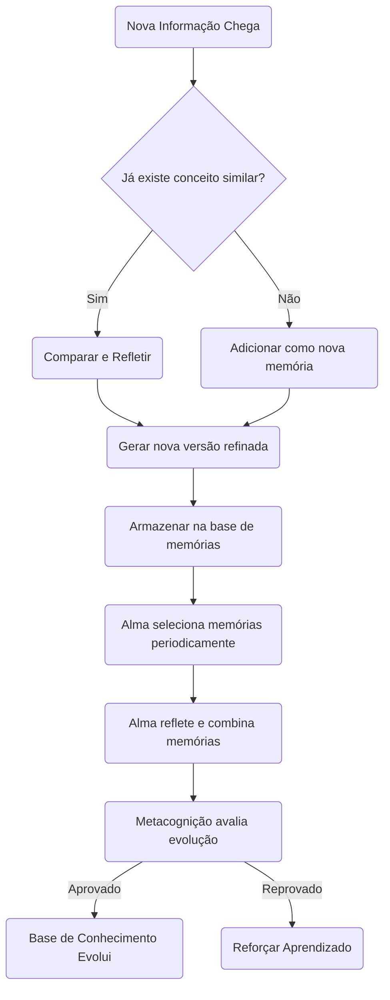

# Projeto: **Sistema de Memória Contínua e Reflexão Autônoma**

## Objetivo

Criar uma inteligência artificial com:
- **Memória contínua**;
- **Capacidade de síntese e refinamento de pensamentos**;
- **Reflexão interna (metacognição)**;
- **Aprendizado dinâmico baseado na experiência**.

---

# Estrutura de Módulos

| Módulo | Função Principal |
|:---|:---|
| **Persona** | Responsável por receber informações, armazenar, aprender e sintetizar. É a "mente" ativa. |
| **Alma** | Responsável por processos internos: relembrar, refletir, combinar, gerar novos conhecimentos, otimizar o sistema. Age "no fundo" de forma constante. |

---

# Tecnologias Utilizadas

- **Linguagem Base**: Python 3.11+
- **Armazenamento Simples**: Arquivos `.json` para memórias (pode futuramente ser um banco de dados)
- **Gerenciamento de Agentes**: Sistema interno baseado em funções Python
- **Randomização Controlada**: Módulo `random`
- **Assincronismo Opcional**: Módulo `asyncio` para processos internos contínuos

---

# Padrão de Código

- Classes bem definidas para cada agente/processo
- Código modularizado por responsabilidade
- Nomemclatura clara e direta (`gerar_sintese`, `refletir_memoria`, `avaliar_aprendizado`, etc)
- Comentários detalhados explicando o objetivo de cada função
- Funções pequenas e coesas

---

# 📚 Funcionamento Geral

---

## 1. Persona

### Responsabilidades:
- Receber informações externas (`input` de eventos);
- Analisar, integrar e comparar com informações antigas;
- Aprender e sintetizar novo conhecimento;
- Armazenar memórias.

### Funções principais:
| Função | Explicação |
|:---|:---|
| `receber_informacao(info: str)` | Recebe um novo dado e inicia o processo de integração. |
| `integrar_informacao(info: str)` | Compara com memórias anteriores, ajusta ou cria uma nova memória. |
| `armazenar_memoria(memoria: dict)` | Salva a nova memória no armazenamento permanente (JSON). |
| `gerar_sintese()` | Durante inatividade, combina memórias antigas para criar novas ideias. |

---

## 2. Alma

### Responsabilidades:
- Gerenciar o fluxo de reflexão contínua;
- Fazer reavaliações internas (metacognição);
- Refinar o conhecimento ao longo do tempo;
- Gerar novos padrões e insights.

### Funções principais:
| Função | Explicação |
|:---|:---|
| `ciclo_de_reflexao()` | Escolhe memórias antigas, compara, refina ou sintetiza novas. |
| `ativar_agente_reflexao()` | Agente que foca em misturar e evoluir conceitos. |
| `ativar_agente_metacognicao()` | Agente que avalia o quão boas são as memórias e o processo de aprendizado. |
| `atualizar_memorias()` | Substitui memórias antigas por versões melhores ou complementares. |

---

# 🔥 Fluxo Detalhado

---

# ⚙️ Como construir cada função

### `receber_informacao(info: str)`
- Valida se o texto é compreensível.
- Chama `integrar_informacao(info)`.

### `integrar_informacao(info: str)`
- Percorre as memórias antigas procurando similaridade.
- Se encontrar, combina e gera uma nova versão.
- Se não encontrar, cria uma nova memória independente.

### `armazenar_memoria(memoria: dict)`
- Abre o arquivo `memorias.json`.
- Adiciona a nova memória no final.

### `gerar_sintese()`
- Escolhe 2 ou 3 memórias antigas aleatórias.
- Junta partes delas, criando uma nova memória mais rica.

### `ciclo_de_reflexao()`
- A cada X minutos, chama funções de relembrar, refletir e combinar memórias.

### `ativar_agente_reflexao()`
- Foca em misturar ideias diferentes para gerar novas sínteses.

### `ativar_agente_metacognicao()`
- Avalia a qualidade das novas memórias.
- Decide manter, reforçar ou modificar o aprendizado.

---

# 🧩 Estrutura de Arquivos

| Arquivo | Conteúdo |
|:---|:---|
| `/core/persona.py` | Funções da Persona (input, integrar, sintetizar) |
| `/core/alma.py` | Funções da Alma (reflexão, metacognição, atualização) |
| `/core/memoria.json` | Base de memórias armazenadas |
| `/core/utils.py` | Funções auxiliares de comparação, randomização, etc. |
| `/core/config.py` | Configurações de tempo de reflexão, thresholds, etc. |

---

# 📈 Fases do Desenvolvimento

| Fase | Descrição | Resultado Esperado |
|:---|:---|:---|
| Fase 1 | Implementar Persona básica para receber e armazenar informações | Sistema grava informações corretamente |
| Fase 2 | Implementar Alma para reflexão simples | Sistema gera novas memórias a partir de antigas |
| Fase 3 | Adicionar Metacognição básica | Sistema começa a avaliar e melhorar seu próprio conhecimento |
| Fase 4 | Ajustar fluxo de síntese durante a inatividade | Sistema pensa mesmo sem input novo |
| Fase 5 | Testes de longo prazo e otimização | Aprendizado contínuo comprovado |

---

# 📌 Observações importantes

- **Não precisa de LLMs gigantes** para a primeira versão (tudo pode ser feito com manipulação de strings/conceitos).
- O **aprendizado vem da comparação, reflexão e síntese** - não é estatístico, é cognitivo.
- A **aleatoriedade é importante** para garantir diversidade de pensamento.
- A metacognição **não impede erro** — ela **aprende com o erro**.

---

# 🧠 Frase para guiar o projeto:

> "Pensar é lembrar, comparar e criar uma nova versão melhor do que existia."

---
